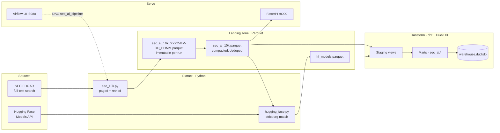
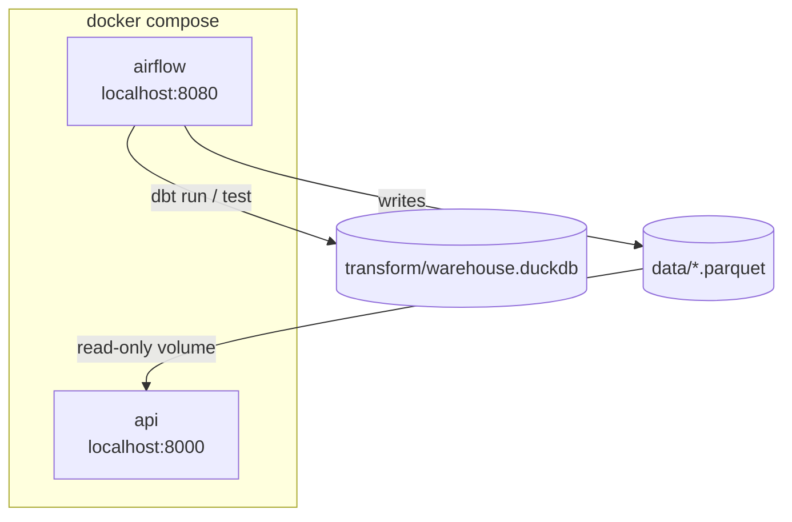
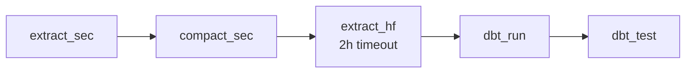
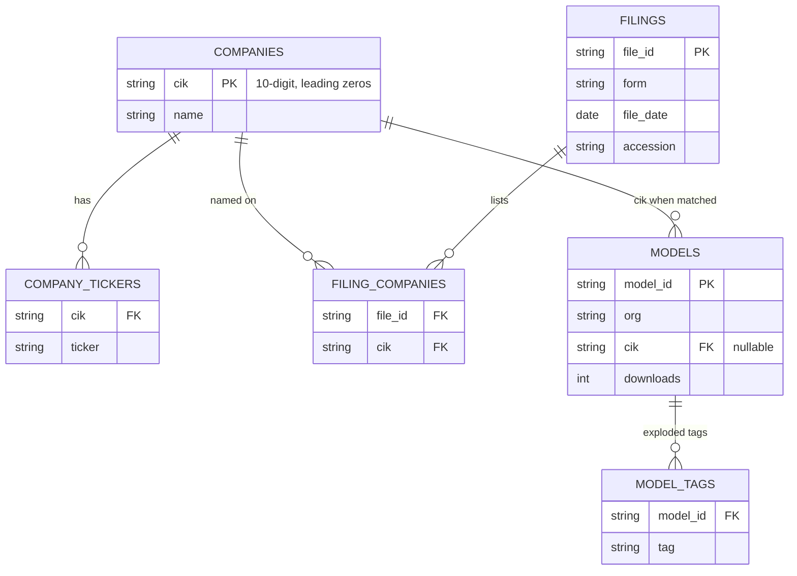
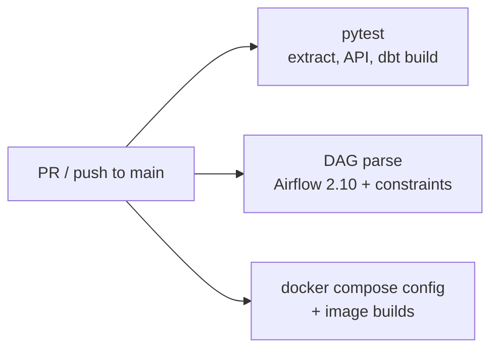

# SEC AI 10-K

**Which public companies disclose AI in their 10-Ks — and which of them actually ship models on Hugging Face?**

This is an end-to-end data platform I built from scratch: ingest SEC EDGAR filings, match companies to Hugging Face orgs without false positives, model a DuckDB warehouse in dbt, orchestrate the job in Airflow, and serve the landing data over FastAPI. The whole stack runs locally with one `docker compose up`.

Hiring managers: this repo is meant to show how I design pipelines — not a notebook dump. You get incremental extracts, a normalized warehouse, tests that gate PRs, and a Dockerized DAG you can actually run.

---

## The problem

Companies talk about artificial intelligence in annual reports. That signal is buried in EDGAR full-text search, messy display names (`NEXTERA ENERGY INC (NEE, NEE-PN) (CIK 0000753308), FLORIDA POWER & LIGHT CO (CIK 0000037634)`), and a Hugging Face hub where a naive name match links **Allegro Microsystems** to an unrelated org named `allegro`.

This project turns that into tables you can query:

- Which filers mention AI, on which accession, on which date?
- Parent vs subsidiary on the same 10-K
- Tickers per CIK (including dual-class: `GOOG` / `GOOGL`)
- Hugging Face models that belong to those companies, with downloads, tags, and pipeline type

---

## Architecture



**One command, two services:** Airflow runs the daily DAG; FastAPI reads the compacted filings parquet.



---

## Daily DAG

`sec_ai_pipeline` — Airflow 2.10, `@daily`, `catchup=False`, `max_active_runs=1`.



| Task | What it does |
|------|----------------|
| `extract_sec` | Search EDGAR for 10-K / 10-K/A hits on `"artificial intelligence"`. Incremental window from the last dated file. Never overwrites an existing dated parquet. |
| `compact_sec` | Union dated extracts → `sec_ai_10k.parquet`, **dedupe by `file_id`** (later wins). |
| `extract_hf` | Distinct companies → conservative org match → concurrent Hub fetches (`HF_WORKERS`, default 8). |
| `dbt_run` | Staging views + mart tables in schema `sec_ai`. |
| `dbt_test` | Uniqueness, not-null, and foreign keys. Failed tests fail the DAG. |

On container start the entrypoint unpauses the DAG and triggers a first run so you do not have to click around the UI.

---

## Warehouse model

Landing files are wide and messy on purpose. dbt turns them into a small star you can join.



**Entity split that matters:** one EDGAR display string can name a parent and a subsidiary. `stg_filing_entities` splits on `(CIK …)` so NextEra and Florida Power & Light become two rows, then `filing_companies` is a real many-to-many.

---

## Design choices hiring managers usually probe

| Choice | Why |
|--------|-----|
| Immutable dated extracts + compact | Re-runs are safe. You can rebuild the canonical file without re-hitting SEC for history. |
| Strict Hugging Face matching | Ticker map (`GOOG`→`google`, `META`→`facebook`, `AMD`→`amd`). No first-word guessing. Prefer missing a match over a wrong one. |
| CIK as the company key | Names change; the 10-digit CIK does not. Leading zeros are kept. |
| dbt tests on every run | Unique `(cik, ticker)`, unique `(file_id, cik)`, FK from models → companies. |
| Extract ↔ dbt contract tests | `tests/test_contract.py` asserts extractor `COLUMNS` == `sources.yml`. A silent schema drift fails CI. |
| DuckDB, not a cloud warehouse | Same dimensional model you would put in Snowflake/BigQuery, runnable on a laptop for review. |

---

## Quality gates



| Layer | What is covered |
|-------|-----------------|
| Unit | SEC paging/retries, HF org matching (mocked HTTP) |
| Contract | Parquet column lists vs dbt sources |
| Transform | Full `dbt build` on fixture landing data; warehouse shape asserted |
| Serve | FastAPI `TestClient` for `/health`, `/data`, `/parquet` |
| Orchestration | DAG imports, task graph `extract_sec → … → dbt_test` |
| Images | Compose validation + Airflow and API Dockerfiles |

CI: [`.github/workflows/ci.yml`](.github/workflows/ci.yml).

---

## Stack

| Layer | Tools |
|-------|--------|
| Extract | Python, requests, PyArrow parquet |
| Transform | dbt-duckdb, DuckDB schema `sec_ai` |
| Orchestrate | Apache Airflow 2.10, SequentialExecutor (local) |
| Serve | FastAPI + Uvicorn |
| Package | Docker Compose |
| Test / CI | pytest, GitHub Actions |

---

## Quick start

```bash
docker compose up --build
```

| Surface | URL |
|---------|-----|
| Airflow | http://localhost:8080 — `admin` / `admin` |
| API | http://localhost:8000 — `/health`, `/data`, `/parquet` |

First Hugging Face pass can be slow. Cap it while testing:

```yaml
# docker-compose.yml → airflow.environment
HF_MAX_COMPANIES: "5"
```

Inspect the warehouse after dbt has run:

```bash
duckdb transform/warehouse.duckdb -f test.sql
```

`test.sql` answers the questions this warehouse is for: row counts, tickers per company, multi-entity filings, HF models joined to CIKs, unmatched orgs, tags on top downloads.

### Local (no Docker)

```bash
python extract/10-k.py
python extract/hugging_face.py

cd transform
dbt run --profiles-dir .
dbt test --profiles-dir .
```

Landing files land in `data/`. `10-k.py` also rebuilds `data/sec_ai_10k.parquet` for dbt.

---

## Layout

```
.
├── extract/                 SEC + Hugging Face extractors
├── data/                    landing parquet (gitignored)
├── transform/               dbt project sec_ai → warehouse.duckdb
│   ├── models/staging/      views over landing
│   └── models/marts/        companies, tickers, filings, models, tags
├── airflow/dags/            sec_ai_pipeline
├── api/                     FastAPI over sec_ai_10k.parquet
├── tests/                   unit, contract, dbt, API, DAG
└── .github/workflows/ci.yml
```

---

## API

| Method | Path | Role |
|--------|------|------|
| `GET` | `/` | Lists endpoints |
| `GET` | `/health` | `{ok, rows, path}` |
| `GET` | `/data` | All filing rows as JSON |
| `GET` | `/parquet` | Download the compacted parquet |

---

Built by **Lefteris Gilmaz** as a portfolio data-engineering system: ingest, model, test, orchestrate, serve.
